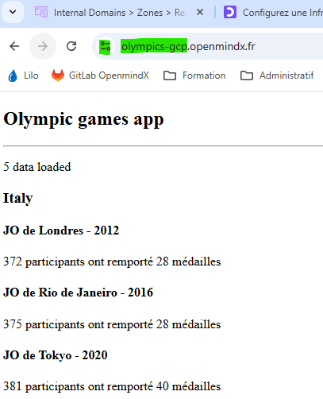

# OC_P6_Ansible : Deployer l'application angular sur une VM sur GCP: 

0. **Prerequis** 
  - sur WSL sur PC avec le compte daniel
    - ssh-keygen -t ed25519 -f ~/.ssh/id_ocp6exo2gcp -C "daniel@ocp6exo2gcp"
 - Compte de service IAM sur Console Google : 
      - fichier json en sortie :  serious-unison-334521-ef79fa28b8b0.json

1. **Terraform : VM a provisionner sur GCP avec ces informations** 
   - Nom de la VM : ocp6exo2gcp
   - Région : europe-west9 (Paris)
   - Type de machine : E2 customisée (2 vCPU, 4 Go de RAM)
   - Disque : 15 Go, OS Ubuntu 24.04 LTS minimal
   - IP fixe publique
   - Ports ouverts : 22 (SSH), 80 (HTTP), 443 (HTTPS)
   - Clé SSH pour connexion depuis PC local

`Fichiers concernés dans le répertoire GCP :`  
   - [main.tf](./main.tf)
   - [variables.tf](./variables.tf) 


2. **DNS : ajouter entre IP publique sur Domaine** 
   - Domaine openmindx.fr 
   - Console Scaleway pour ajouter alias DNS  vers 
     -  IP publique sur olympics-gcp.openmindx.fr : 34.155.216.222

   - Attendre la propagation DNS  , peut etre un eu long ( 15minutes mini )
     - vérifier par la commande dig sur PC / WSL:
     ```bash
        dig olympics-gcp.openmindx.fr
        #ANSWER attendu  : 
        ;; ANSWER SECTION:
        olympics-gcp.openmindx.fr. 3303 IN      A       34.155.216.222
     ```

3. **Ansible : Build et deploy ** 
   - Déploiement de la l'application dans une image Docker
   - lancement de l'application sur ngin
       - Serveur_name : olympics-gcp.openmindx.fr 

4. **Test du site sur navigateur pc :** 
   -  http://olympics-gcp.openmindx.fr

5. **Ajout certificat pour sésuriser**
    ```bash
    ssh -i ~/.ssh/id_ocp6exo2gcp daniel@34.155.216.222
       sudo apt install certbot python3-certbot-nginx -y
       sudo certbot --nginx -d olympics_gcp.openmindx.fr
    ```
   - Test du site sur navigateur pc : 
     - `https://olympics-gcp.openmindx.fr`


7. **Commandes utiles** 
  - Connexion sur la VP GCP 
    - ssh -i ~/.ssh/id_ocp6exo2gcp daniel@34.155.216.222
    - sudo nginx -t
    - sudo systemctl reload nginx
    - sudo tail -f /var/log/nginx/error.log

    - sudo apt install certbot python3-certbot-nginx -y
    - sudo certbot --nginx -d olympics_gcp.openmindx.fr
  - Verification vm GCP 
    - Ajouter au ~/.bashrc si besoin  

    ```bash
      echo "--------------------------------------------------"
      echo "Bienvenue sur $(hostname) !"
      echo "--------------------------------------------------"
      echo "Système : $(grep -i pretty /etc/os-release | cut -d '"' -f 2)"
      echo "CPU : $(lscpu | grep 'Model name' | cut -d ':' -f 2 | xargs) ($(nproc) cœurs)"
      echo "Mémoire : $(free -h | awk '/Mem/{print $3 "/" $2}') utilisée"
      echo "IP publique : $(curl -s -H "Metadata-Flavor: Google" http://metadata.google.internal/computeMetadata/v1/instance/network-interfaces/0/access-configs/0/external-ip)"
      echo "--------------------------------------------------"
    ```

  - Verification nginx ecoute sur port 80 : 
    - sudo ss -tulnp | grep nginx
    - resultat attendu
  ```bash
     daniel@ocp6exo2gcp:~$ sudo ss -tulnp | grep nginx
     tcp   LISTEN 0      511            0.0.0.0:443       0.0.0.0:*    users:(("nginx",pid=9562,fd=12),("nginx",pid=9561,fd=12),("ngin",pid=9409,fd=12))
     tcp   LISTEN 0      511            0.0.0.0:80        0.0.0.0:*    users:(("nginx",pid=9562,fd=5),("nginx",pid=9561,fd=5),("nginx",pid=9409,fd=5))
  ```

8. **Test Application : olympics-gcp.openmindx.fr**
   - :accessibility: Si tout est OK le site répond sur le navigateur à l'URL : **`http://olympics-gcp.openmindx.fr`  ** 
   - *Lien : [http://olympics-gcp.openmindx.fr](http://olympics-gcp.openmindx.fr)*
     
       
