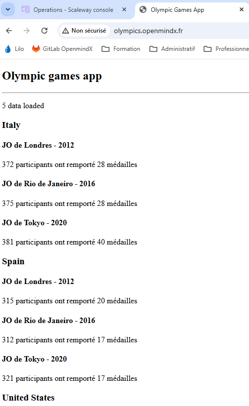

# OC_P6_Ansible
## Clé d accès AWS générée pour le compte ocp6-terrafom avec role limité à EC2 

1. **VM fournit par AWS via TERRAFORM**
   - resource "aws_instance" "my_server" 
     - region = "eu-west-3"
     - ami           = "ami-0ef9bcd5dfb57b968" # ubuntu zone paris
     - instance_type = "t3.micro"
     - associate_public_ip_address = false  # elastic ip utilisée
   - resource "aws_eip" "my_eip"
   - resource "aws_security_group" "my_security_group"
   - resource "tls_private_key" "my_ssh_key"
   - resource "aws_key_pair" "generated_key"  

2. **Informations VM  et IP statique générée**
  - aws_eip.my_eip.public_ip
    - "35.180.1.165"  
  - aws_eip.my_eip.public_dns
    - "ec2-35-180-1-165.eu-west-3.compute.amazonaws.com"
  - "ssh -i ~/.ssh/aws_${aws_key_pair.generated_key.key_name}.pem ubuntu@${aws_eip.my_eip.public_dns}"
    - "ssh -i ~/.ssh/aws_openclassrooms_devops_p6.pem ubuntu@ec2-35-180-1-165.eu-west-3.compute.amazonaws.com" 

3. **Inventaire Ansible format yml : hosts.yml**
   - un seul serveur dans l'inventaire , serveur web sur AWS : fichier 
   - Référencé par le aws_eip.my_eip.public_dns :ec2-35-180-1-165.eu-west-3.compute.amazonaws.com
     
   - [hosts.yml](.hosts.yml)
```json
all:
  children:
    webservers:  # Groupe pour les serveurs web : un seul serveur ici mais prévoyons ...
      hosts:
        # eip: public dns
        ec2-35-180-1-165.eu-west-3.compute.amazonaws.com:
          ansible_user: ubuntu
          ansible_ssh_private_key_file: ~/.ssh/aws_openclassrooms_devops_p6.pem
          ansible_python_interpreter: /usr/bin/python3.12
```

4. **Problème sur VM micro**
   - Ressource mémoire sous dimesionnée sur l offre gratuite : t3.micro
   - Nombreux plantages ou machine figée pendant déploiement
      - passage sur region Paris mais pas d amélioration significatives
      - Ajout Fic 2Go Swap : Playbook a jouer avant : [setup_swap.yml](./setup_swap.yml)

   **Etapes principales**
   ```bash
   - name: Configurer un fichier swap de 2 Go
       - name: Désactiver le swap existant (si présent)
       - name: Supprimer l'ancien fichier swap (si présent)
       - name: Créer un nouveau fichier swap de 2 Go
       - name: Définir les permissions du fichier swap
       - name: Formater le fichier swap
       - name: Activer le fichier swap
       - name: Ajouter le swap au fstab pour le rendre persistant
   ```

5. **Fix NGNIX  : fichier nginix.cfg adapté**
   - alias DNS sur Elastic IP publique sur olympics.openmindx.fr ( Domaine perso sur Scaleway )
   ```bash
   ┌──(daniel㉿LAPTOP-CMCF5R42:)-[/mnt/c/Users/danie/OC-ED-P6/OC_P6_Ansible]
   └─$ dig olympics.openmindx.fr | grep -i olympics
      ; <<>> DiG 9.18.39-0ubuntu0.24.04.2-Ubuntu <<>> olympics.openmindx.fr
      **olympics.openmindx.fr.  3600    IN      A       35.180.1.165**
   ```
  - Fix Nginx : [fix-nginx/angular-app](./fix-nginx/angular-app)
     - appliquer dans le playbook deploy.yml
     - en particulier la clause **`server_name olympics.openmindx.fr;`**

6. **Deploiement Application : deploy.yml**
   - Construction et déploiement du site sur la VM aws
   -  [deploy.yml](./deploy.yml)
   - **Principales étapes :**
```yaml
   ┌──(daniel㉿LAPTOP-CMCF5R42:)-[/mnt/c/Users/danie/OC-ED-P6/OC_P6_Ansible]
   └─$ egrep 'tasks|handlers|notify|name' deploy.yml
   - name: Déployer une application Angular avec Nginx
     tasks:
       - name: Installer les dépendances système
           name: ["nodejs", "npm", "git", "nginx"]
       - name: Cloner le dépôt Angular
       - name: Installer les dépendances Node.js
       - name: Builder l'application Angular
       - name: Déployer la configuration Nginx pour Angular
       - name: Activer la configuration Nginx
       - name: Supprimer la configuration par défaut de Nginx
         notify: Redémarrer Nginx
     handlers:
       - name: Redémarrer Nginx
           name: nginx 
```   
   
8. **Test Application : olympics.openmindx.fr**
   - Si tout est OK le site répond sur le navigateur à l'URL : **`http://olympics.openmindx.fr`**
   - *Lien : [http://olympics.openmindx.fr](http://olympics.openmindx.fr)*
     
       

 
